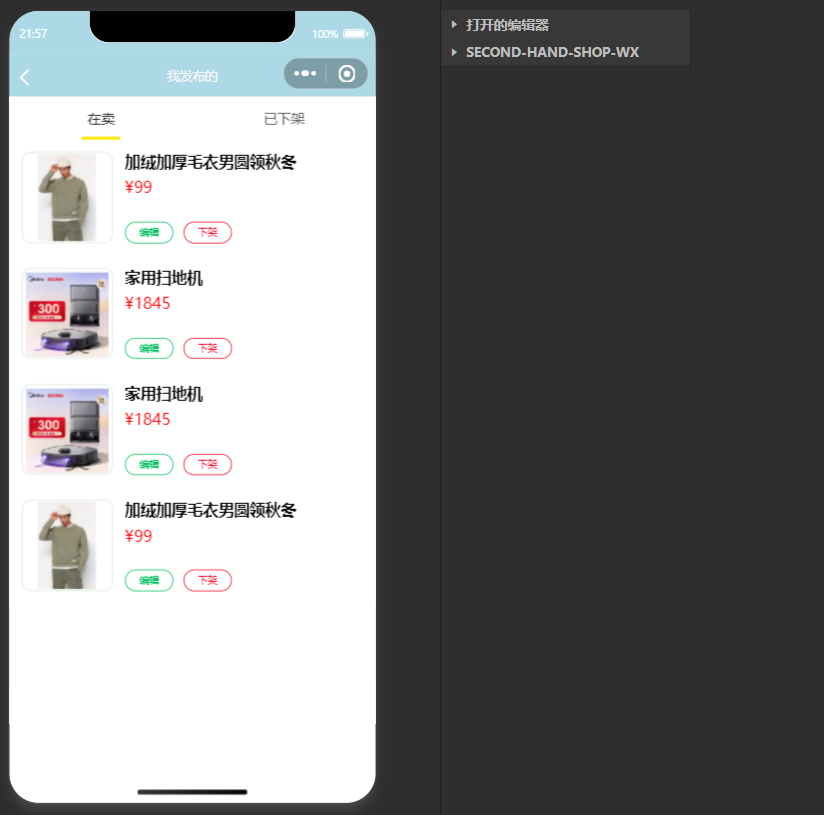

# 校园二手交易小程序 闲置物品交易网站 

## 一、介绍（获取方式文章末尾）
计算机毕业设计 闲置物品交易网站 校园二手交易小程序 功能如图所示  
## 🚀温馨提示
##### 所传代码为网站 不是小程序 如有疑问可查看个人主页联系我们

## 二、技术栈
1.  前端：vue框架，微信原生小程序
2.  后端：nodejs express框架
3.  数据库：mysql
 
## 三、效果展示  

## 小程序
### 1.用户端

### 2.后台管理（管理端）

## 四、🚀 咨询我们
1.  有需要或者疑问可加微信号：rolling_257
2.  请备注 二手交易小程序源码获取
3.  提示该项目需要付费获取，编码不易

